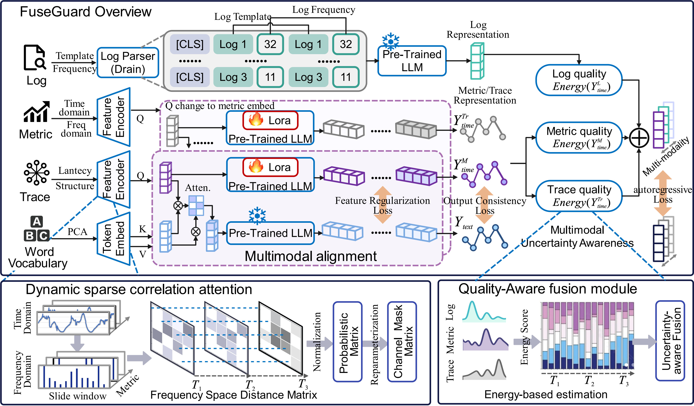

# Few-shot Multimodal Anomaly Detection via Dynamic Intra-modal Sparsity Attention and Quality-aware Cross-modal Fusion in Microservice System


## Introduction
FuseGuard is a novel framework that combines ***dynamic feature learning*** with quality-aware ***multimodal alignment and fusion***.
FuseGuard aims to tackle few-shot anomaly detection with two critical challenges in microservice system: effective feature extraction from intra-modalities, and the alignment of heterogeneous multimodal representations,

the overall architecture of FuseGuard is shown in [Figure 2](#fig-workflow):
- **Intra-modal Feature Extraction** performs modality-specific feature extraction: capturing dynamic correlations for metrics, spatiotemporal patterns for traces, and both semantic and statistical features for logs.
- **Cross-modal Alignment** integrates cross-modal fine-tuning of pre-trained LLMs to bridge the modality gap between traces, metrics, and logs.
- **Quality-aware Multimodal Fusion** dynamically adjusts modality weights based on real-time quality assessment for optimal fusion.

<p align="center" id="fig-workflow">
     
    <br>
    <strong>Figure 2:</strong> Framework Overview.
</p>

## Prerequisites
Before proceeding, ensure Python 3.9 is installed. Install the required dependencies with the following command:

```
pip install -r requirements.txt
```

## Dataset Preparation

### Multimodal data preprocess
Acquire datasets from [MSDS](https://zenodo.org/record/3549604.),[GAIA](https://github.com/CloudWise-OpenSource/GAIA-DataSet) and
[TT](https://github.com/FudanSELab/train-ticket/). 
Metric is preprocessed into multivariate time series format. Trace is organized by TraceID and similarly transformed into multivariate time series, followed by normalization. For log, we employ the Drain3 to extract templates and compute their occurrence frequencies.

Organize them in the `./datasets` directory as shown below:

```
datasets
├── MSDS
│   └── traindata.csv
│   ├── traindata_fewshot.csv
│   └── testdata.csv
├── GAIA
│   └── traindata.csv
│   ├── traindata_fewshot.csv
│   └── testdata.csv
├── TT
│   └── traindata.csv
│   ├── traindata_fewshot.csv
│   └── testdata.csv

```

## Preparing Word Token Embeddings

Execute the command below to extract principal components from the word token embeddings:

```
python pca.py
```

These embeddings will be saved in `./wte_pca_500.pt`.

## Model Training

Training scripts are located in the `./scripts` folder. For instance, to train the Fuseguard model on the TT dataset for anomaly detection, execute:

```
sh scripts/anomaly_detaction/TT.sh
```

Post-Training:

- Trained models will be saved in `./checkpoints`.
- Numerical results are available in `.npy` format under `./results`.
- Detailed summaries of performance metrics can be found in `./results_{task_name}.txt`.


